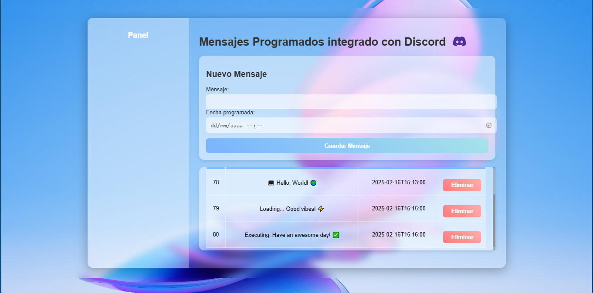
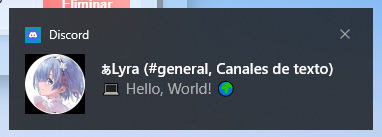
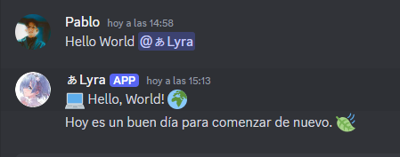
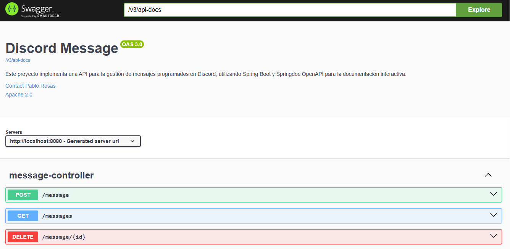
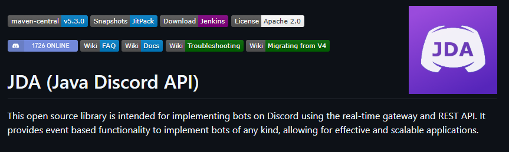

<div align="center">
  
  <h2>
    🌐Discord Message Scheduler 📩
  </h2>

<p align="center">
    <!-- Insignias para Discord-Message con color morado -->
    <a href="https://github.com/Dev-Asfix/Discord-Message?tab=License-1-ov-file"></a>
    <a href="https://github.com/Dev-Asfix/Discord-Message/issues"></a>
    <a href="https://github.com/Dev-Asfix/Discord-Message/graphs/contributors"></a>
</p>
</div>

Este proyecto es un servicio backend desarrollado con **Spring Boot**, que permite **programar y gestionar mensajes automáticos en Discord**. Utiliza **JDA** para la interacción con Discord, **Spring Boot** para la gestión del backend y **MySQL** como base de datos.

<!-- Tabla para organizar imágenes -->
<table width="100%">
  <tr>
    <!-- Columna izquierda: Imagen de información -->
    <td align="left" width="60%">
      
    </td>
    <td align="right" width="60%">
      
      <br><br>
      
    </td>
  </tr>
</table>


## 🚀 Características

- 📌 **Programación de mensajes** con fecha y hora específicas.
- 🔄 **Eliminación automática** de mensajes programados después de su envío.
- 📝 **Validaciones** con `Jakarta Validation` para garantizar datos correctos.
- 🌐 **API REST** documentada con `Swagger`.
- 🔧 **Configuración flexible** con variables de entorno y `application.properties`.
- 🎨 **Interfaz moderna y responsive** desarrollada con `HTML` y `CSS`.
- 🔄 **Renderización dinámica** de datos con `Thymeleaf`.
---
<div align="center">

</div>


## 📦 Instalación

### 1️⃣ Clonar el repositorio
```sh
 git clone https://github.com/Dev-Asfix/Discord-Message.git
 cd Discord-Message
```

### 2️⃣ Configurar la base de datos MySQL
Crea la base de datos con el siguiente comando en MySQL:
```sql
CREATE DATABASE discorddb;
```

Asegúrate de configurar correctamente las credenciales en `application.properties`:
```properties
spring.datasource.url=jdbc:mysql://localhost:3307/discorddb?serverTimezone=America/Lima
spring.datasource.username=${USER}
spring.datasource.password=${PASSWORD}
```

### 3️⃣ Configurar las variables de entorno
Crea un archivo `.env` en la raíz del proyecto:
```sh
TOKEN=TU_BOT_DISCORD_TOKEN
IdCanalDeDiscord=ID_DEL_CANAL
```

### 4️⃣ Ejecutar la aplicación
```sh
mvn spring-boot:run
```

---


## 📌 Endpoints de la API

| Método   | Endpoint         | Descripción                           |
|----------|-----------------|---------------------------------------|
| 🟢 `POST`   | `/message`       | Crea un mensaje programado            |
| 🔵 `GET`    | `/messages`      | Lista todos los mensajes programados  |
| 🟣 `PUT`    | `/message/{id}`  | Actualiza un mensaje programado       |
| 🔴 `DELETE` | `/message/{id}`  | Elimina un mensaje programado         |
| 🟡 `GET`    | `/home`         | Muestra una interfaz usando Thymeleaf |


Puedes probar la API con **Swagger UI** accediendo a:
```
http://localhost:8080/swagger-ui/index.html
```
<table width="100%">
  <tr>
    <td colspan="2" align="center">
      
    </td>
  </tr>
</table>


## 🚀 Servicios  

### 📌 `MessageScheduler.java`
Este servicio se encarga de:
- Buscar mensajes programados cuya fecha ya ha pasado.
- Enviarlos al canal de Discord usando `DiscordService`.
- Eliminar los mensajes enviados de la base de datos.

📌 **Método clave:**
```java
@Scheduled(cron = "0 * * * * *")
@Transactional
public void sendScheduledMessages();
```
🔹 Se ejecuta cada minuto y verifica si hay mensajes que deben enviarse.  
🔹 Usa discordService.sendMessage() para enviarlos y los elimina tras su envío.

---

<table width="100%">
  <tr>
    <td colspan="2" align="center">
      
    </td>
  </tr>
</table>

## 🤖 DiscordService.java
Este servicio gestiona la conexión con Discord usando JDA (Java Discord API).

### 📌 `MessageScheduler.java`
Características::
- Autenticación: Usa el token del bot almacenado en application.properties.
- Envío de mensajes: Envía mensajes al canal configurado.

📌 **Método clave:**
```java
public void sendMessage(String message);
```
🔹 Obtiene el canal de Discord por su ID y envía el mensaje.

---

## ⚙️ Tecnologías utilizadas   


<div align="center">
  
  
  
  
  
  
  
  
  
  

  
</div>

- **Spring Boot 3.4.2**
- **JDA (Java Discord API) 5.0.0-beta.14**
- **Spring Data JPA y Hibernate**
- **MySQL 8**
- **Spring Validation**
- **Swagger para documentación**

---

## 🤝 Contribuciones
¡Las contribuciones son bienvenidas! Si deseas mejorar el proyecto, sigue estos pasos:
1. **Fork** este repositorio.
2. Crea una rama con la nueva funcionalidad: `git checkout -b feature/nueva-funcionalidad`
3. Realiza el commit de tus cambios: `git commit -m 'Agregada nueva funcionalidad'`
4. Sube la rama: `git push origin feature/nueva-funcionalidad`
5. Abre un **Pull Request**.

---

## 📄 Licencia
Este proyecto está licenciado bajo **Apache 2.0**. Puedes ver más detalles en [`LICENSE`](LICENSE).

---

## 🛠 Mantenimiento y contacto
**Autor:** Pablo Aldair Rosas Ramírez  
📧 Email: [rosasramirez753@gmail.com](mailto:rosasramirez753@gmail.com)  
🔗 GitHub: [Dev Asfix](https://github.com/Dev-Asfix)  
💼 LinkedIn: [Pablo Rosas Ramirez](https://www.linkedin.com/in/pablo-rosas-dev/)

---

Hecho con ❤️ por Dev Asfix 🚀